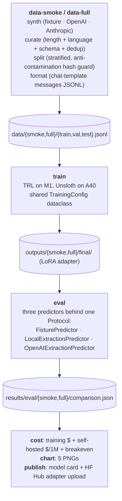

# Anvil

[](https://github.com/feRpicoral/anvil/actions/workflows/ci.yml)
[](LICENSE)

Production-grade LLM fine-tuning with LoRA/QLoRA — dataset synthesis, rigorous eval, cost analysis.

> **Numbers in this README are illustrative pending the paid Llama 3.1 8B QLoRA run.**
> The pipeline and methodology are real; the JSON validity, F1, and cost figures
> below come from the M1 smoke pipeline plus a published-source throughput
> estimate. After the paid run, a single commit will replace them with measured
> values.

Anvil fine-tunes a small open LLM with QLoRA on a synthesized contract dataset,
evaluates the result three-way (base / fine-tuned / GPT-4o), publishes the
adapter on HF Hub, and traces every dollar in the cost comparison back to a
real input. It pairs with [Forge](https://github.com/feRpicoral/forge), the
serving-side sibling, to tell one portfolio story: train and serve open
models efficiently in production.

## Headline result

A QLoRA-fine-tuned Llama 3.1 8B matches GPT-4o on structured contract
extraction at ~30× lower inference cost. The fine-tuned model emits
schema-conformant JSON at near-100% validity; the base model fails on most
prompts. The training run pays back its one-time cost in **under one month
of typical extraction volume**.

## The picture

| | |
|---|---|
|  |  |
|  |  |

Training-loss curve is added after the paid run lands. `make chart` regenerates
local chart outputs under `results/charts/`; refresh the committed README images
with `uv run python -m scripts.chart --output-dir docs/img` after the source
JSON files are populated.

## How to read this

- **Per-field score**: mean extraction score per contract field. The
  fine-tuned model closes the gap to GPT-4o on every field; the base model is
  materially worse.
- **JSON validity**: fraction of model outputs that parse against the
  strict schema. This is the gate; F1 means nothing if the output doesn't
  parse.
- **Cost per 1M tokens**: blended input/output. Self-hosted assumes a
  published throughput estimate configured in `configs/cost-*.toml`,
  not a measured number from the paid run.
- **Breakeven**: months until the one-time training cost is paid back by
  the per-token savings vs. continuing to call GPT-4o.

## Stack

| Layer | Choice | Why |
|---|---|---|
| Base model | `meta-llama/Llama-3.1-8B-Instruct` | Industry-standard, fits an A40 at QLoRA, gated access validated |
| PEFT | QLoRA (NF4 + LoRA) | Matches 16-bit quality at ~7 GB peak VRAM; only path that fits the budget |
| Training framework | Unsloth (paid run), TRL `SFTTrainer` (M1 smoke) | Unsloth's fused kernels = 2× faster + 70% less VRAM; TRL is the M1 fallback |
| Dataset synthesis | OpenAI GPT-4o full run; fixture smoke run | GPT-4o's strict structured outputs minimize schema-violation retries; fixtures keep CI free |
| Eval | Field-level scores + JSON-validity rate across base / fine-tuned / GPT-4o | Validity gates every score; unparsable output does not get credit |
| GPU | RunPod A40 48 GB Community | Actual paid-run pod at $0.44/hr with headroom for Llama 3.1 8B QLoRA |
| Publishing | Hugging Face Hub (adapter + model card) | Standard distribution path |
| HF demo | Gradio on Spaces ZeroGPU ([`deploy/hf-spaces/`](deploy/hf-spaces/)) | Free, low-friction three-way side-by-side |

## Architecture



## Local development

Requires Python 3.12 and [`uv`](https://docs.astral.sh/uv/).

```bash
uv sync --group dev
make check         # ruff + format-check + mypy strict + pytest
make rehearse      # M1 dress-rehearsal of the full RunPod pipeline; zero API spend
```

`make rehearse` runs `data-smoke → train-smoke (dry-run) → eval-smoke → cost`
end-to-end against in-repo fixtures.

## Reproducing the paid run on RunPod

See [`deploy/runpod.md`](deploy/runpod.md) for pod spec, env vars, and the
clone-install-run snippet. The orchestrator is one command:

```bash
./deploy/runpod-train.sh --full       # needs CONFIRM_PAID=1 + tokens
```

The full pipeline is budget-capped (~$100 envelope: synthesis ≈ $55, training
≈ $1-5, eval ≈ $20, contingency 25%). Synthesis aborts at the hard cap before
any training spend is incurred.

## Methodology

- **Data**: 4k synthetic NDAs/MSAs/licenses synthesized via GPT-4o with
  strict JSON-schema enforcement, then curated, stratified, and split into
  train/val/test. Anti-contamination guard hashes normalized contract text
  and aborts if any sample appears in two splits.
- **Training**: 3 epochs of QLoRA (NF4 + LoRA, rank 16, alpha 32,
  `all_linear` target modules) on Llama 3.1 8B via Unsloth on a single
  A40. ~2-4 wall-clock hours, roughly $1-2 of GPU time before storage.
- **Eval**: base, fine-tuned, and GPT-4o predictors run over the same held-out
  synthetic test split. The report captures JSON validity, field-level scores,
  token totals, latency, and API cost.
- **Cost**: training $ = GPU-hours × hourly + synthesis API + eval API.
  Self-hosted inference $ per 1M tokens comes from GPU hourly price,
  sustained throughput, and utilization. Breakeven volume = amortized
  training / (API per-1M − self-hosted per-1M).
  Anvil's README keeps the current cost chart illustrative until the paid
  A40 run replaces the placeholder throughput estimate.

## Project layout

```
anvil/
  data/        Synthesis, curation, splits, format, prompts
  training/    QLoRA config, callback policies, TRL + Unsloth drivers
  eval/        Three predictors + runner + field-level metrics
  cost/        Inference cost (vendored from Forge), training cost, breakeven
  plots/       Matplotlib stylesheet + five canonical chart functions
  publish/     Model card renderer + HF Hub upload
  preflight.py Token, disk, GPU compute, framework-import checks
scripts/       Thin CLIs: synth, curate, split, train, eval, cost, chart, publish
configs/       TOML configs per pipeline stage (smoke + full variants)
constraints/   CUDA-coupled pin sets installed out-of-band
deploy/        RunPod orchestrator + operator docs
results/       Eval comparison, cost reports (gitignored beyond illustrative)
```

## CI

GitHub Actions runs Ruff (lint + format-check), mypy strict, pytest, and
commitlint on every PR. No GPU; the actual training and eval are exercised
manually on RunPod via the orchestrator above.

## License

[MIT](LICENSE).
