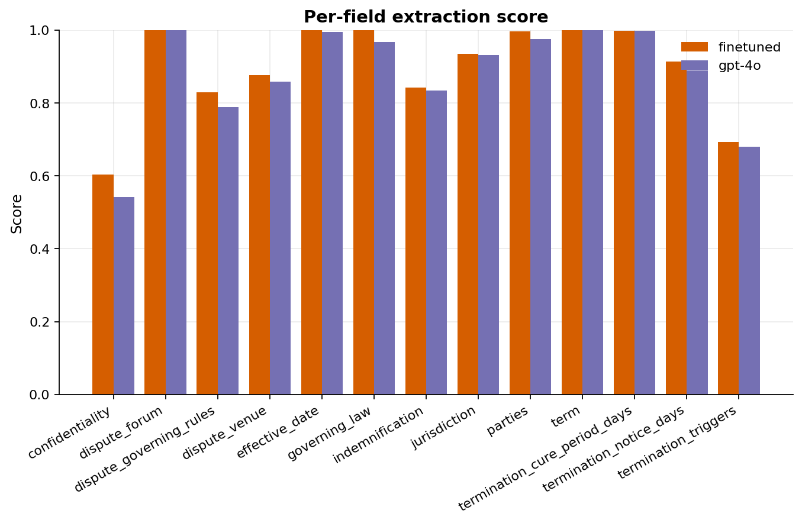
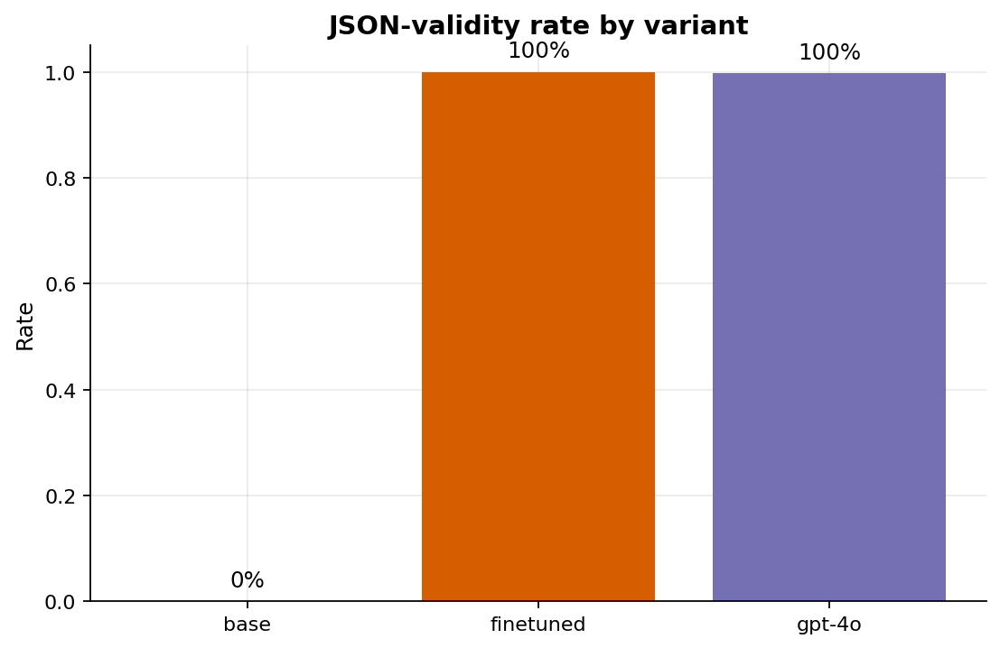
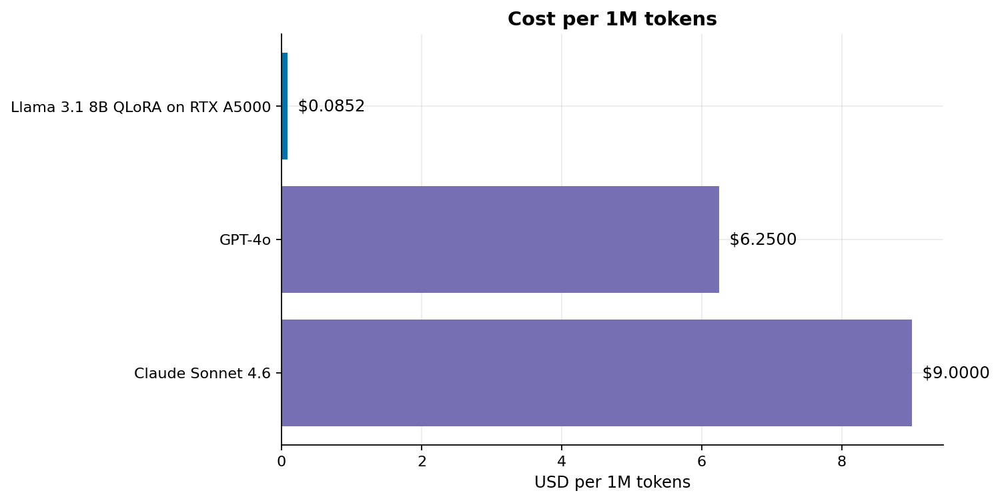
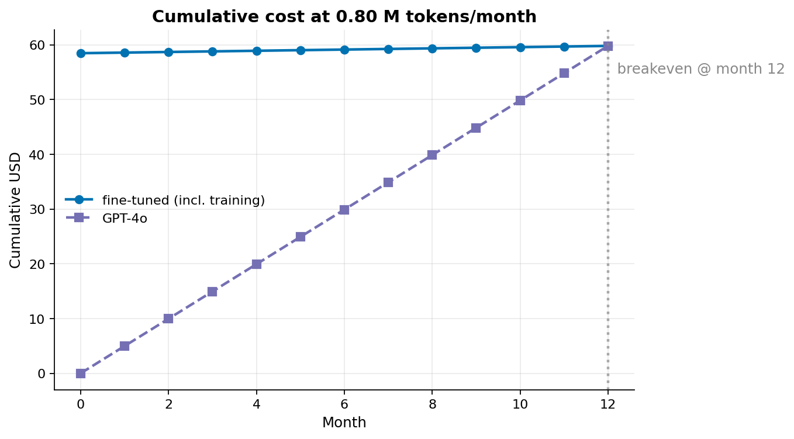
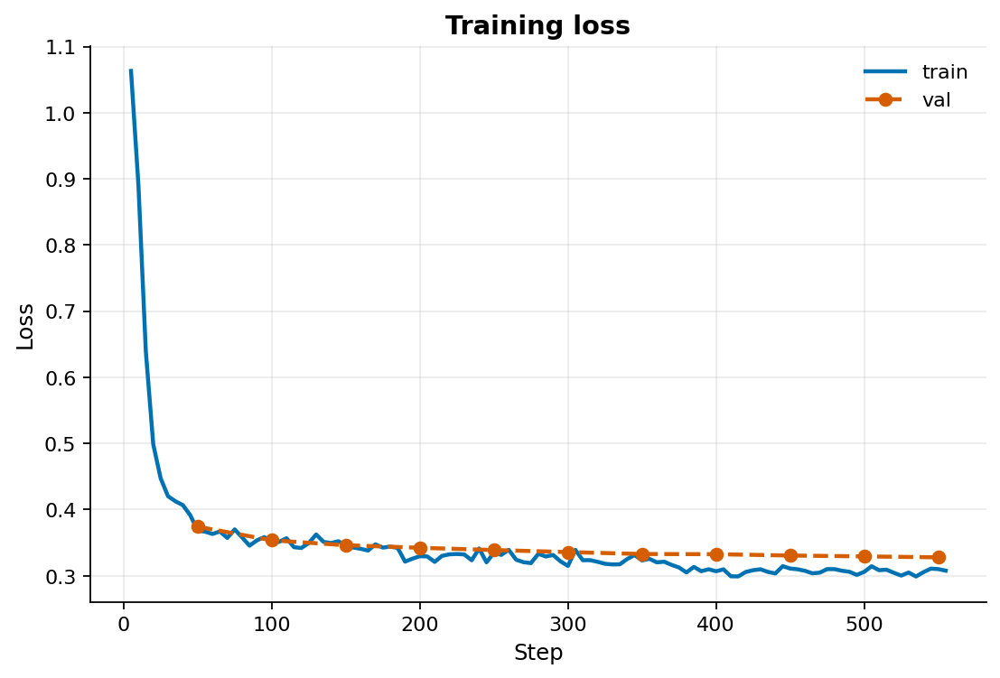
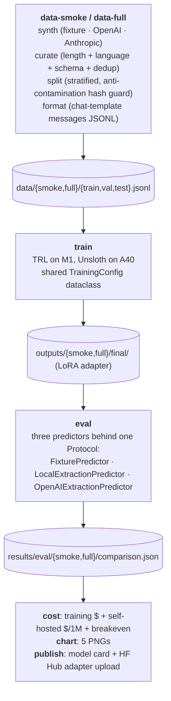

# Anvil

[](https://github.com/feRpicoral/anvil/actions/workflows/ci.yml)
[](LICENSE)

Production-grade LLM fine-tuning with LoRA/QLoRA — dataset synthesis, rigorous eval, cost analysis.

Anvil fine-tunes a small open LLM with QLoRA on a synthesized contract dataset,
evaluates the result three-way (base / fine-tuned / GPT-4o), publishes the
adapter on HF Hub, and traces every dollar in the cost comparison back to a
real input. It pairs with [Forge](https://github.com/feRpicoral/forge), the
serving-side sibling, to tell one portfolio story: train and serve open
models efficiently in production.

## Headline result

A QLoRA-fine-tuned Llama 3.1 8B reached **100% JSON validity** on 370 held-out
synthetic contracts, while the base model produced 0% valid JSON. It slightly
exceeded GPT-4o on macro field score (**0.899 vs. 0.881**) and ran at
**$0.1389 per 1M tokens** under the configured A40 serving assumptions. The
full run cost **$58.46** and breaks even against GPT-4o at **0.80M tokens per
month** over a 12-month horizon.

## The picture

| | |
|---|---|
|  |  |
|  |  |
|  | |

`make chart` regenerates local chart outputs under `results/charts/`. Refresh
the committed README images with:

```bash
uv run python -m scripts.chart \
  --eval-comparison results/eval/full/comparison.json \
  --cost-report results/cost/full.json \
  --loss-history results/train/full/loss-history.json \
  --output-dir docs/img
```

## How to read this

- **Per-field score**: mean extraction score per contract field. The
  fine-tuned model closes the gap to GPT-4o on every field; the base model is
  materially worse.
- **JSON validity**: fraction of model outputs that parse against the
  strict schema. This is the gate; F1 means nothing if the output doesn't
  parse.
- **Cost per 1M tokens**: blended input/output. Self-hosted uses the configured
  A40 serving-throughput assumption in `configs/cost-*.toml`; serving throughput
  was not benchmarked during this training run.
- **Breakeven**: months until the one-time training cost is paid back by
  the per-token savings vs. continuing to call GPT-4o.

## Stack

| Layer | Choice | Why |
|---|---|---|
| Base model | `meta-llama/Llama-3.1-8B-Instruct` | Industry-standard, fits an A40 at QLoRA, gated access validated |
| PEFT | QLoRA (NF4 + LoRA) | Matches 16-bit quality at ~7 GB peak VRAM; only path that fits the budget |
| Training framework | Unsloth (paid run), TRL `SFTTrainer` (M1 smoke) | Unsloth's fused kernels = 2× faster + 70% less VRAM; TRL is the M1 fallback |
| Dataset synthesis | OpenAI GPT-4o full run; fixture smoke run | GPT-4o's strict structured outputs minimize schema-violation retries; fixtures keep CI free |
| Eval | Field-level scores + JSON-validity rate across base / fine-tuned / GPT-4o | Validity gates every score; unparsable output does not get credit |
| GPU | RunPod A40 48 GB Community | Actual paid-run pod at $0.44/hr with headroom for Llama 3.1 8B QLoRA |
| Publishing | Hugging Face Hub (adapter + model card) | Standard distribution path |
| HF demo | Gradio on Spaces ZeroGPU ([`deploy/hf-spaces/`](deploy/hf-spaces/)) | Free, low-friction three-way side-by-side |

## Architecture



## Local development

Requires Python 3.12 and [`uv`](https://docs.astral.sh/uv/).

```bash
uv sync --group dev
make check         # ruff + format-check + mypy strict + pytest
make rehearse      # M1 dress-rehearsal of the full RunPod pipeline; zero API spend
```

`make rehearse` runs `data-smoke → train-smoke (dry-run) → eval-smoke → cost`
end-to-end against in-repo fixtures.

## Reproducing the paid run on RunPod

See [`deploy/runpod.md`](deploy/runpod.md) for pod spec, env vars, and the
clone-install-run snippet. The orchestrator is one command:

```bash
./deploy/runpod-train.sh --full       # needs CONFIRM_PAID=1 + tokens
```

The full pipeline is budget-capped (~$100 envelope: synthesis ≈ $55, training
≈ $1-5, eval ≈ $20, contingency 25%). The paid A40 run used 4,000 raw
synthetic contracts and finished at $58.46 total: $54.00 synthesis, $1.76 GPU,
and $2.70 GPT-4o eval.

## Methodology

- **Data**: 4,000 synthetic NDAs/MSAs/licenses synthesized via GPT-4o with
  strict JSON-schema enforcement. Curation accepted 3,707 records and rejected
  293, then split them into 2,966 train, 371 val, and 370 test examples.
  Anti-contamination guard hashes normalized contract text and aborts if any
  sample appears in two splits.
- **Training**: 3 epochs of QLoRA (NF4 + LoRA, rank 16, alpha 32,
  `all_linear` target modules) on Llama 3.1 8B via Unsloth on a single
  A40. The paid run completed 558 optimizer steps in 8,259 seconds
  (about 2h 18m), ending at train loss 0.346 and eval loss 0.328.
- **Eval**: base, fine-tuned, and GPT-4o predictors run over the same held-out
  370-example synthetic test split. Base validity was 0%, fine-tuned validity
  was 100%, and GPT-4o validity was 99.73%; macro field score was 0.899 for
  fine-tuned vs. 0.881 for GPT-4o.
- **Cost**: training $ = GPU-hours × hourly + synthesis API + eval API.
  Self-hosted inference $ per 1M tokens comes from GPU hourly price,
  sustained throughput, and utilization. Breakeven volume = amortized
  training / (API per-1M − self-hosted per-1M). The reported self-hosted
  inference cost uses the configured A40 serving-throughput assumption, not a
  measured serving benchmark.

## Project layout

```
anvil/
  data/        Synthesis, curation, splits, format, prompts
  training/    QLoRA config, callback policies, TRL + Unsloth drivers
  eval/        Three predictors + runner + field-level metrics
  cost/        Inference cost (vendored from Forge), training cost, breakeven
  plots/       Matplotlib stylesheet + five canonical chart functions
  publish/     Model card renderer + HF Hub upload
  preflight.py Token, disk, GPU compute, framework-import checks
scripts/       Thin CLIs: synth, curate, split, train, eval, cost, chart, publish
configs/       TOML configs per pipeline stage (smoke + full variants)
constraints/   CUDA-coupled pin sets installed out-of-band
deploy/        RunPod orchestrator + operator docs
results/       Eval comparison, cost reports, and committed full-run summaries
```

## CI

GitHub Actions runs Ruff (lint + format-check), mypy strict, pytest, and
commitlint on every PR. No GPU; the actual training and eval are exercised
manually on RunPod via the orchestrator above.

## License

[MIT](LICENSE).
